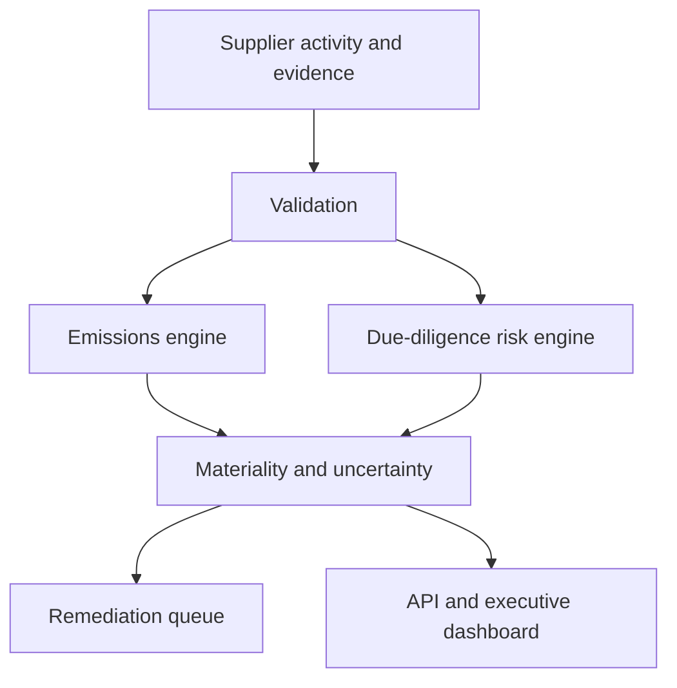

# Supplier Sustainability Risk Platform

[](https://github.com/Lonfea/supplier-sustainability-risk-platform/actions/workflows/ci.yml)


An explainable analytics service for supplier greenhouse-gas estimation, climate exposure, environmental and human-rights due diligence, remediation prioritization and management reporting.

> Independent portfolio project with synthetic suppliers and illustrative factors. Not legal advice and not affiliated with Infineon.

## What it demonstrates

- Activity- and spend-based Scope 3 emission estimation
- Data-quality hierarchy and uncertainty intervals
- Climate, biodiversity, water and human-rights risk signals
- LkSG-style due-diligence workflow with evidence and remediation status
- Explainable materiality score and prioritized action queue
- Scenario analysis for supplier engagement and renewable-electricity adoption
- FastAPI, Streamlit, Docker, tests and CI



## Run

```bash
python -m venv .venv && source .venv/bin/activate
pip install -e '.[dev]'
pytest
uvicorn sustainability.api:app --reload
streamlit run src/sustainability/dashboard.py
```

The engine deliberately separates measured, supplier-specific and spend-estimated emissions. Missing evidence increases uncertainty and priority rather than being treated as zero impact.

See [model governance](docs/governance.md).

